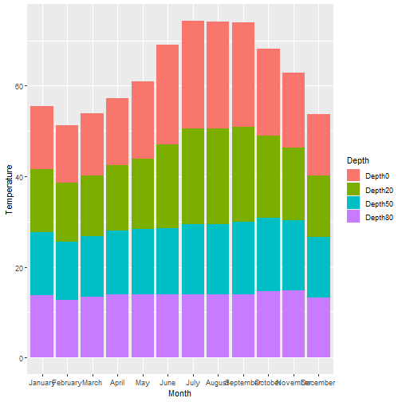
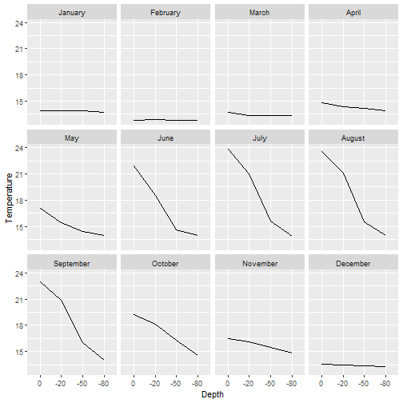
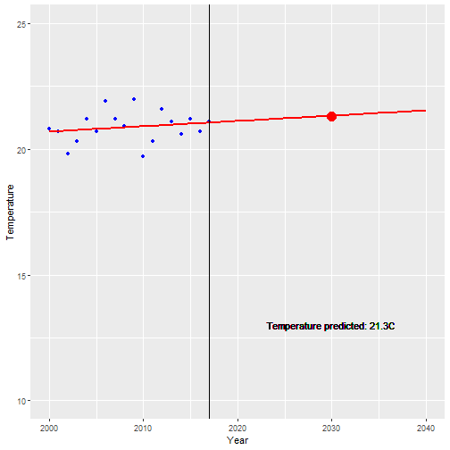

Week4Presentation
========================================================
autosize: true

Introduction
========================================================

- Sea temperatures from North West Mediterranean zone are analyzed in this exercise.

- Temperatures are measured in different depths: 0, -20, -50 and -80 meters.

- There is a mesure per each month since 2000 until 2017.

- Source data used is placed in: https://www.idescat.cat/pub/?id=aec&n=218&lang=es

Monthly temperatures
========================================================

Temperatures variation in depth
========================================================

Temperature prediction on August 2030 in -20 meters depth
========================================================

